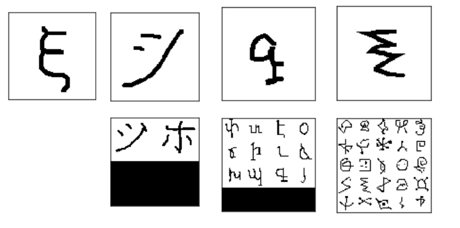

# One-shot learning by Hernán Borré


Pairwise training loading dataset based on the [Omniglot dataset]( https://github.com/brendenlake/omniglot ).

Code and data preprocessing inspired from this amazing [blog post](https://sorenbouma.github.io/blog/oneshot).


## Installation Instructions


To run, you'll first have to clone this repo and install the dependencies.
I use conda for package and enviroment manager, so preferably to keep things up you should have it installed

Please try to create your project through the environment.yml file which was provided.

If not possible, then you can alternatively use package-list.txt as follows:

```bash
git clone https://github.com/hernanborre/oneshot-hb
cd oneshot-hb
conda create -n myenv --file package-list.txt

```


The Omniglot dataset is included in the project. Let's preprocess/pickle it with the load_data.py script.
```bash
python load_data.py --path <PATH TO THIS FOLDER>
```
Finally you can run the jupyter notebook and search for the file "Dataset Loading.ipynb" to play with the data and load N-Shot dataset ready to use images!
```bash
jupyter notebook
```

